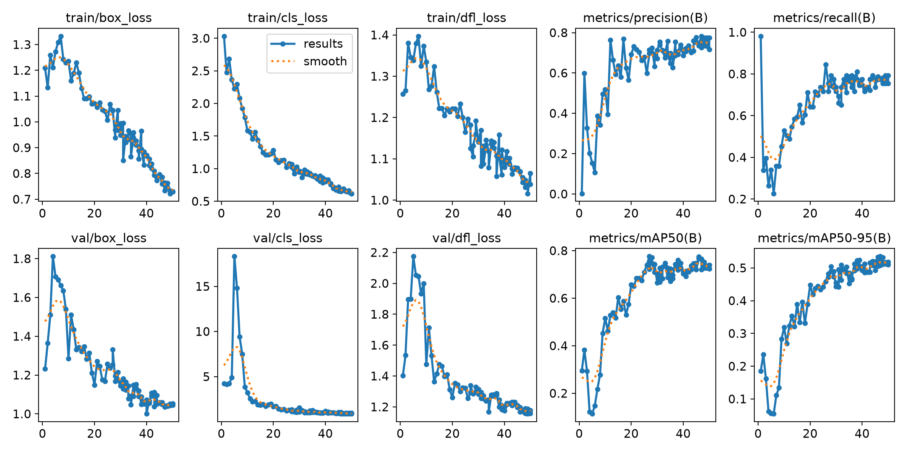
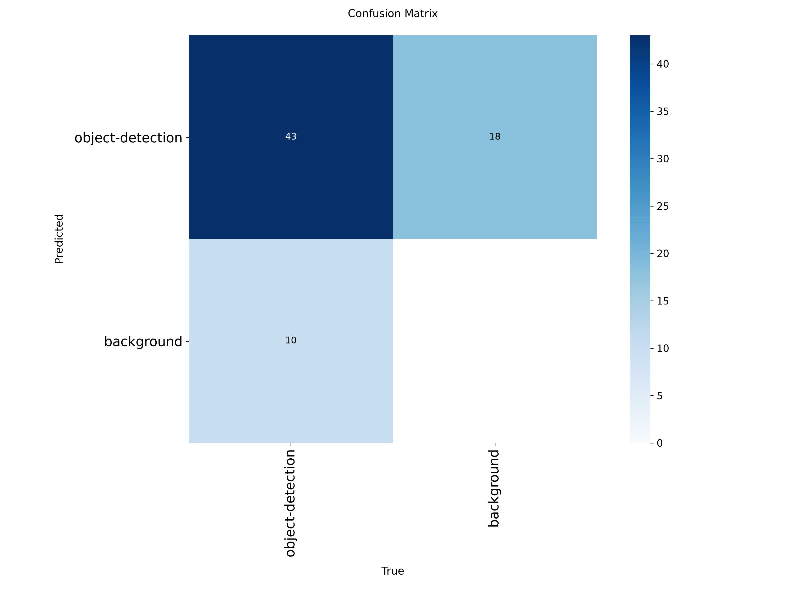
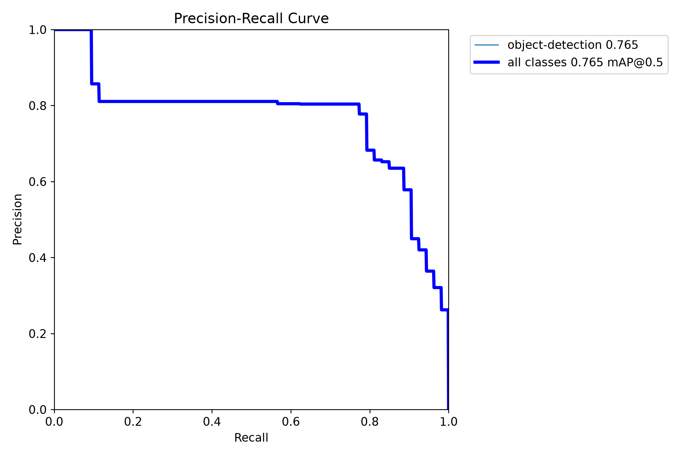
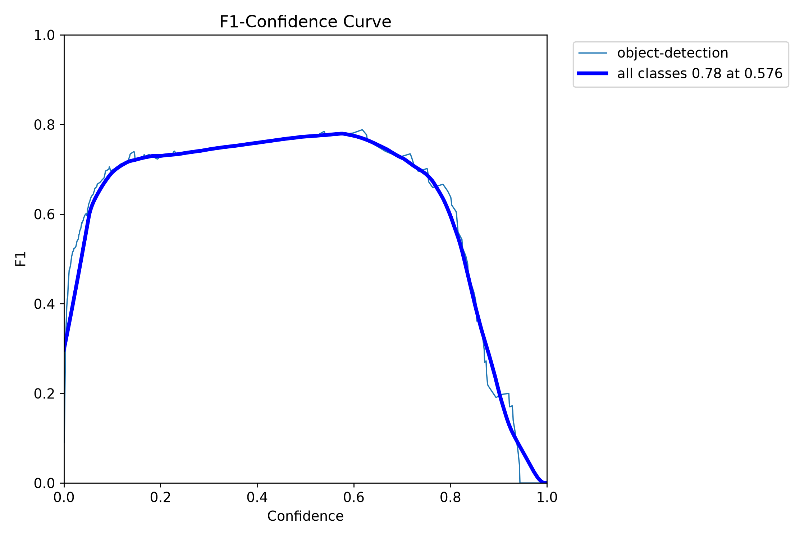
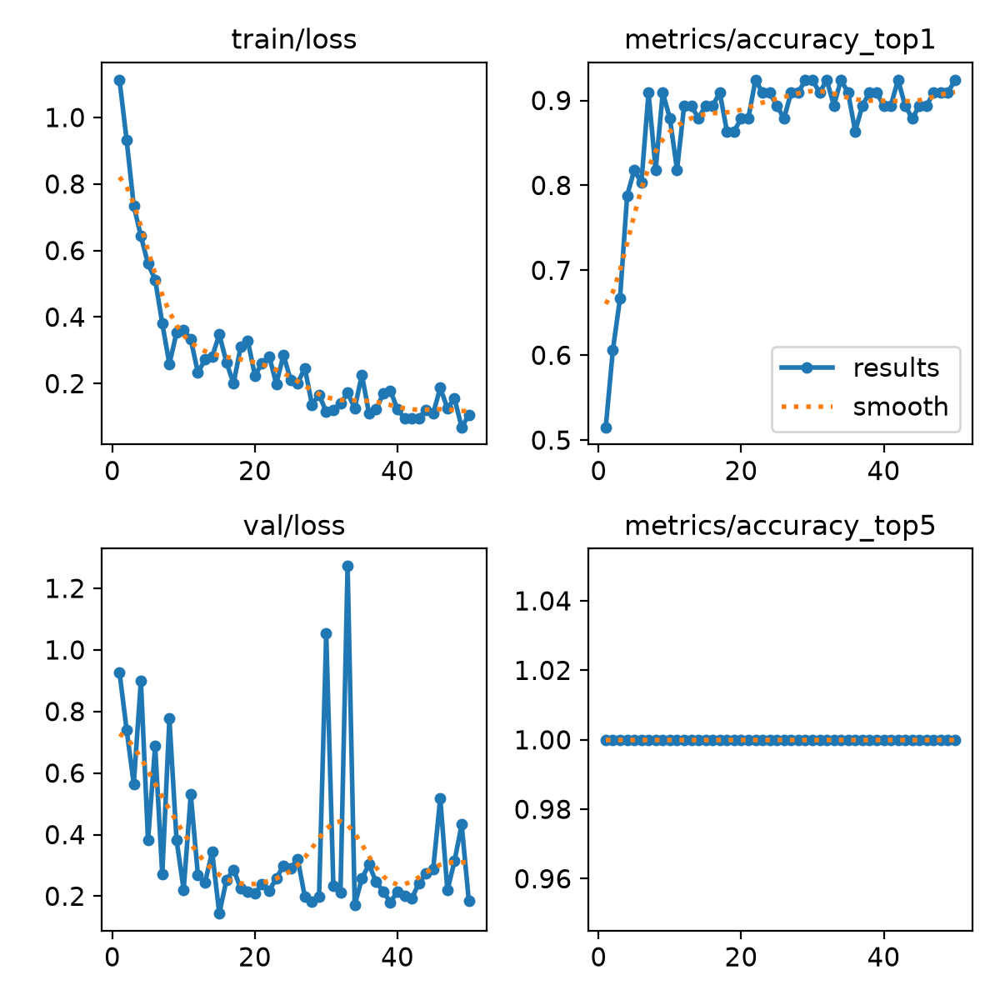
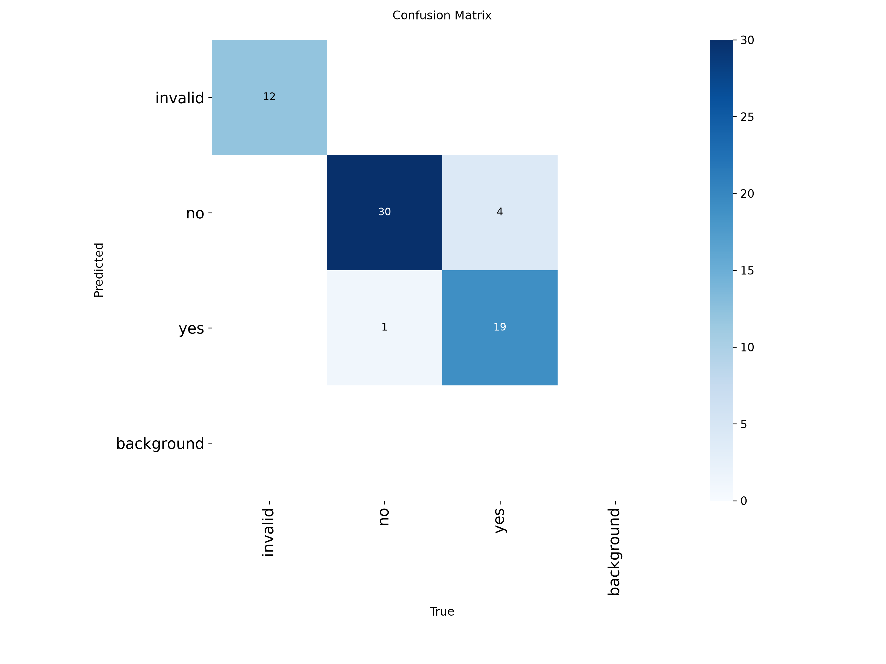
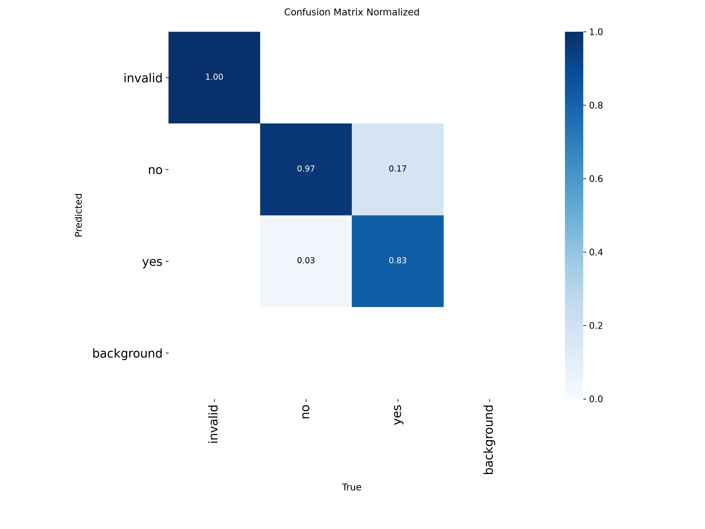
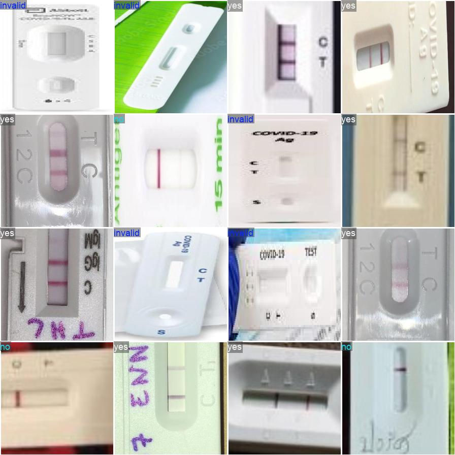
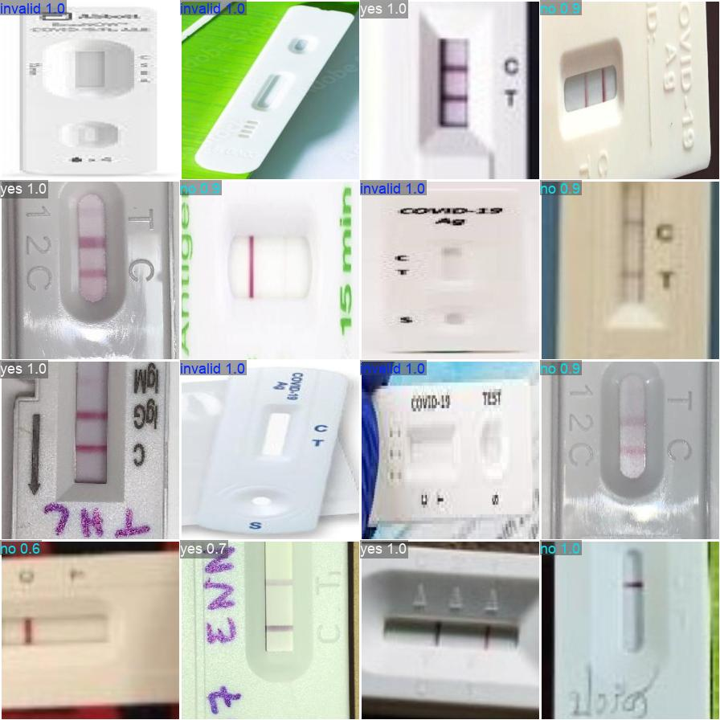

# COVID-19 Rapid Test Diagnostic Pipeline

This project builds a two-stage deep learning pipeline for reading home COVID-19 rapid antigen test images.

The final workflow is:

```text
Full image
  -> YOLOv8 object detector finds the rapid test device / result area
  -> the detected box is cropped
  -> YOLOv8 classifier predicts the diagnostic result
```

The diagnostic classifier predicts:

```text
yes      positive test: both C and T lines are visible
no       negative test: C line only
invalid  invalid test: no valid control/result line
```

## Architecture

The project uses two separate YOLO models.

```text
Phase 1 detector:
  model type: YOLOv8 object detection
  class: object-detection
  purpose: locate the COVID rapid test device/result area
  weights: runs/detect/runs/detect/covid_testkit_labeler/weights/best.pt

Phase 2 classifier:
  model type: YOLOv8 classification
  classes: yes, no, invalid
  purpose: classify a cropped rapid test image
  weights: runs/classify/covid_result_classifier/weights/best.pt
```

The detector does not decide positive/negative/invalid. It only crops the useful image region. The classifier makes the final diagnostic prediction from the crop.

## Setup On Windows

Open PowerShell in this repository.

Optional virtual environment:

```powershell
py -3 -m venv .venv
.\.venv\Scripts\Activate.ps1
```

If PowerShell blocks activation:

```powershell
Set-ExecutionPolicy -Scope Process -ExecutionPolicy Bypass
.\.venv\Scripts\Activate.ps1
```

Install dependencies:

```powershell
python -m pip install --upgrade pip
python -m pip install -r requirements.txt
```

Check YOLO:

```powershell
yolo version
```

If `yolo` is not recognized, use the full executable path:

```powershell
C:\Users\Saleem\AppData\Roaming\Python\Python314\Scripts\yolo.exe version
```

Or add this folder to PATH:

```text
C:\Users\Saleem\AppData\Roaming\Python\Python314\Scripts
```

## Environment

Create `.env` from `.env.example` and add a Roboflow API key when downloading datasets:

```env
ROBOFLOW_API_KEY=your_roboflow_api_key_here
ROBOFLOW_VERSION=1
```

The `.env` file is ignored by git.

## Phase 1: Object Detection

Phase 1 trains a YOLO detector to locate the COVID rapid test kit/result area in full images.

### Dataset Source

Images were downloaded from Roboflow Universe using the official Roboflow SDK/API, not website scraping.

```text
https://universe.roboflow.com/new-workspace-4ssos/atk-detection-kit-dataset
workspace: new-workspace-4ssos
project: atk-detection-kit-dataset
version: 1
```

The dataset preparation produced:

```text
dataset/
  train/images/   400 images
  test/images/    100 images
```

Download again:

```powershell
python download_dataset.py --provider roboflow --roboflow-workspace new-workspace-4ssos --roboflow-project atk-detection-kit-dataset --roboflow-version 1 --target 500
```

Expected summary:

```text
total downloaded: 500
duplicates removed: 26
train count: 400
test count: 100
```

### Detection Labels

The 400 training images were labeled in CVAT and exported in YOLO format:

```text
with_labels/yolo_with_label/obj_Train_data/
```

Prepare the detector dataset:

```powershell
python scripts/prepare_labeled_dataset.py
```

Prepared structure:

```text
dataset_labeled/
  train/images/   320
  train/labels/   320
  val/images/     80
  val/labels/     80
```

YOLO config:

```text
configs/covid_test_dataset.yaml
```

### Train The Detector

```powershell
yolo detect train model=yolov8n.pt data=configs/covid_test_dataset.yaml epochs=50 imgsz=640 project=runs/detect name=covid_testkit_labeler
```

Resume if needed:

```powershell
yolo detect train resume model=runs/detect/runs/detect/covid_testkit_labeler/weights/last.pt
```

Final detector weights:

```text
runs/detect/runs/detect/covid_testkit_labeler/weights/best.pt
runs/detect/runs/detect/covid_testkit_labeler/weights/last.pt
```

Final detector validation metrics were approximately:

```text
Precision: 0.718  = 71.8%
Recall:    0.755  = 75.5%
mAP50:     0.724  = 72.4%
mAP50-95:  0.511  = 51.1%
```

Detector training curves:



Detector confusion matrix:



Detector precision-recall and F1 curves:





### Test The Detector

Run detection on the 100 held-out test images:

```powershell
yolo detect predict model=runs/detect/runs/detect/covid_testkit_labeler/weights/best.pt source=dataset/test/images save=True save_txt=True save_conf=True project=runs/detect name=test_predictions_final
```

Outputs:

```text
runs/detect/runs/detect/test_predictions_final/
runs/detect/runs/detect/test_predictions_final/labels/
```

The detector created prediction label files for 67 of the 100 held-out test images at the default confidence threshold.

```text
Detection coverage on held-out test images: 67 / 100 = 67.0%
```

If too many images have no detection, try a lower threshold:

```powershell
yolo detect predict model=runs/detect/runs/detect/covid_testkit_labeler/weights/best.pt source=dataset/test/images save=True save_txt=True save_conf=True conf=0.10 project=runs/detect name=test_predictions_low_conf
```

## Phase 2: Diagnostic Classification

Phase 2 uses the Phase 1 detector to crop each test kit/result area, then trains a classifier on those crops.

### Classification Dataset

The classifier dataset uses YOLO classification folder format:

```text
classification_dataset/
  train/
    yes/
    no/
    invalid/
  val/
    yes/
    no/
    invalid/
```

Each image in this dataset is a crop of the rapid test device/result area, not the full original photo.

Current classifier labels were created manually with:

```text
p = positive / yes
n = negative / no
i = invalid
s = skip
u = undo
q = quit
```

The label history is stored in:

```text
classification_dataset/labels_manifest.csv
```

Final Phase 2 split after adding confirmed invalid examples:

```text
train: yes 102, no 120, invalid 51
val:   yes 23,  no 31,  invalid 12
```

### Interactive Crop And Label Tool

The script below loads the detector, crops each image, opens a small labeling window, and saves the crop into the selected class folder:

```powershell
python scripts/label_cropped_tests.py --source dataset_labeled/train/images --split train
```

For validation:

```powershell
python scripts/label_cropped_tests.py --source dataset_labeled/val/images --split val
```

For extra unlabeled downloaded images:

```powershell
python scripts/label_cropped_tests.py --source extra_unlabeled_covid_test_lines_v2/train/images --split train
python scripts/label_cropped_tests.py --source extra_unlabeled_covid_test_lines_v2/test/images --split val
```

Use `--relabel` only if you intentionally want to review images already recorded in the manifest:

```powershell
python scripts/label_cropped_tests.py --source dataset_labeled/val/images --split val --relabel
```

### Extra Image Source

An additional Roboflow Universe project was downloaded only as an image source. Its labels were not trusted or imported.

```text
https://universe.roboflow.com/deep-learning-m91hq/covid-test-lines-v2
workspace: deep-learning-m91hq
project: covid-test-lines-v2
version: 3
```

Download command:

```powershell
python download_dataset.py --provider roboflow --roboflow-workspace deep-learning-m91hq --roboflow-project covid-test-lines-v2 --roboflow-version 3 --roboflow-format folder --dataset-dir extra_unlabeled_covid_test_lines_v2 --target 314
```

Download summary:

```text
total downloaded: 252
duplicates removed: 62
train count: 201
test count: 51
```

Many of these extra images were blurry, too close, or difficult to read. Those images were skipped during manual labeling when the result could not be trusted.

### Train The Classifier

Train YOLOv8 classification:

```powershell
yolo classify train model=yolov8n-cls.pt data=classification_dataset epochs=50 imgsz=224 project=runs/classify name=covid_result_classifier
```

Training settings from the final run:

```text
model: yolov8n-cls.pt
epochs: 50
imgsz: 224
batch: 16
device: CPU
classes: yes, no, invalid
```

Final classifier weights:

```text
runs/classify/covid_result_classifier/weights/best.pt
runs/classify/covid_result_classifier/weights/last.pt
```

Training outputs:

```text
runs/classify/covid_result_classifier/results.csv
runs/classify/covid_result_classifier/results.png
runs/classify/covid_result_classifier/confusion_matrix.png
runs/classify/covid_result_classifier/confusion_matrix_normalized.png
```

Final epoch validation metrics:

```text
accuracy_top1: 0.92424 = 92.424%
accuracy_top5: 1.0     = 100.0%
val/loss:      0.18589
```

Best observed validation accuracy during training:

```text
accuracy_top1: 0.92424 = 92.424% at epochs 22, 29, 30, 32, 34, 42, and 50
```

Classifier training curves:



Classifier confusion matrix:



Normalized classifier confusion matrix:



Validation labels and model predictions:





The final invalid-boost run includes invalid examples in both training and validation. This makes the validation result more meaningful than the earlier run, which had no invalid validation images.

### Validate The Classifier

Use validation mode for folder-structured classification data:

```powershell
yolo classify val model=runs/classify/covid_result_classifier/weights/best.pt data=classification_dataset
```

This predicts every validation image and compares the prediction against the folder name. The folder name is the ground-truth label.

### Predict On Class Folders

`yolo classify predict` expects images directly inside the source folder. For this dataset, run it on each class folder separately:

```powershell
yolo classify predict model=runs/classify/covid_result_classifier/weights/best.pt source=classification_dataset/val/yes save=True project=runs/classify name=result_predictions_yes
```

```powershell
yolo classify predict model=runs/classify/covid_result_classifier/weights/best.pt source=classification_dataset/val/no save=True project=runs/classify name=result_predictions_no
```

```powershell
yolo classify predict model=runs/classify/covid_result_classifier/weights/best.pt source=classification_dataset/val/invalid save=True project=runs/classify name=result_predictions_invalid
```

## Full Diagnostic Pipeline

The complete application should combine both models:

```text
input full image
  -> detect test kit/result area with Phase 1 best.pt
  -> crop the best bounding box
  -> classify the crop with Phase 2 best.pt
  -> print yes/no/invalid and confidence
```

Suggested script:

```text
diagnose_covid_test.py
```

Expected output shape:

```text
image: covid_test_000003.jpg
detection confidence: 0.82
classification: no
classification confidence: 0.91
final result: negative test
```

## Project Files

```text
configs/
  covid_test_dataset.yaml

docs/
  first-three-phases.md
  phase2.md
  phase2-instructions.md
  Project2.pdf

scripts/
  prepare_labeled_dataset.py
  split_dataset.py
  label_cropped_tests.py

dataset/                         
dataset_labeled/                 
with_labels/                     
classification_dataset/          
cropped_tests/                   
extra_unlabeled_covid_test_lines_v2/ 

runs/detect/                     detector training/prediction outputs
runs/classify/                   classifier training/prediction outputs
```

## Known Risks And Improvements

- The `invalid` class has fewer examples than `yes` and `no`, but the final invalid-boost run now includes invalid examples in validation.
- Some downloaded extra images were blurry, too zoomed in, or impossible to read; these should be skipped rather than guessed.
- More invalid examples should be collected or manually created before relying on invalid classification.
- A final `diagnose_covid_test.py` script should be added to run detection and classification in one command.
- A held-out `classification_dataset/test/` split would make final reporting stronger.
